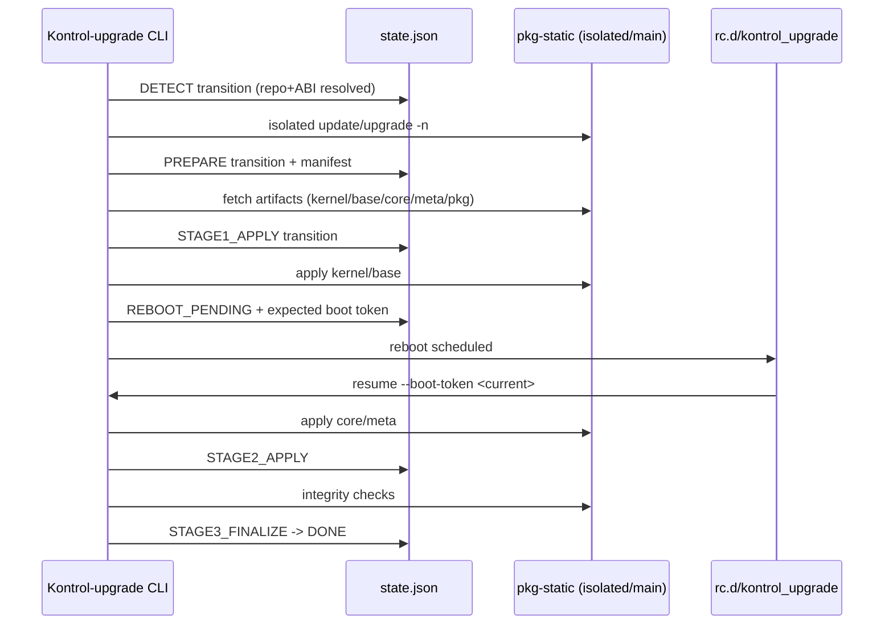

# Kontrol-upgrade v2 Engine

## Sequência de fases

## Plano de migração do legado

1. **Instalação paralela**: substituir apenas `/usr/local/libexec/Kontrol-upgrade`, mantendo wrapper e comando público.
2. **Compatibilidade de CLI**: flags legadas `-c -u -n -R -y -b` continuam aceitas e mapeadas para subcomandos.
3. **Ativação pós-boot**: habilitar rc script `kontrol_upgrade` para executar `resume` somente quando o estado explícito for `REBOOT_PENDING`.
4. **Rollback operacional**:
   - Se subcomando falhar, estado muda para `FAILED` com último erro.
   - Operador pode executar `abort` para marcar `ROLLBACK_NEEDED`.
   - Rotas de recuperação devem consultar `state.json` e `manifest.json` para reaplicar versão anterior.
5. **Cutover**:
   - validar `check` e `prepare` em ambiente de staging;
   - depois validar cenário com reboot real;
   - somente então remover artefatos legados antigos.
